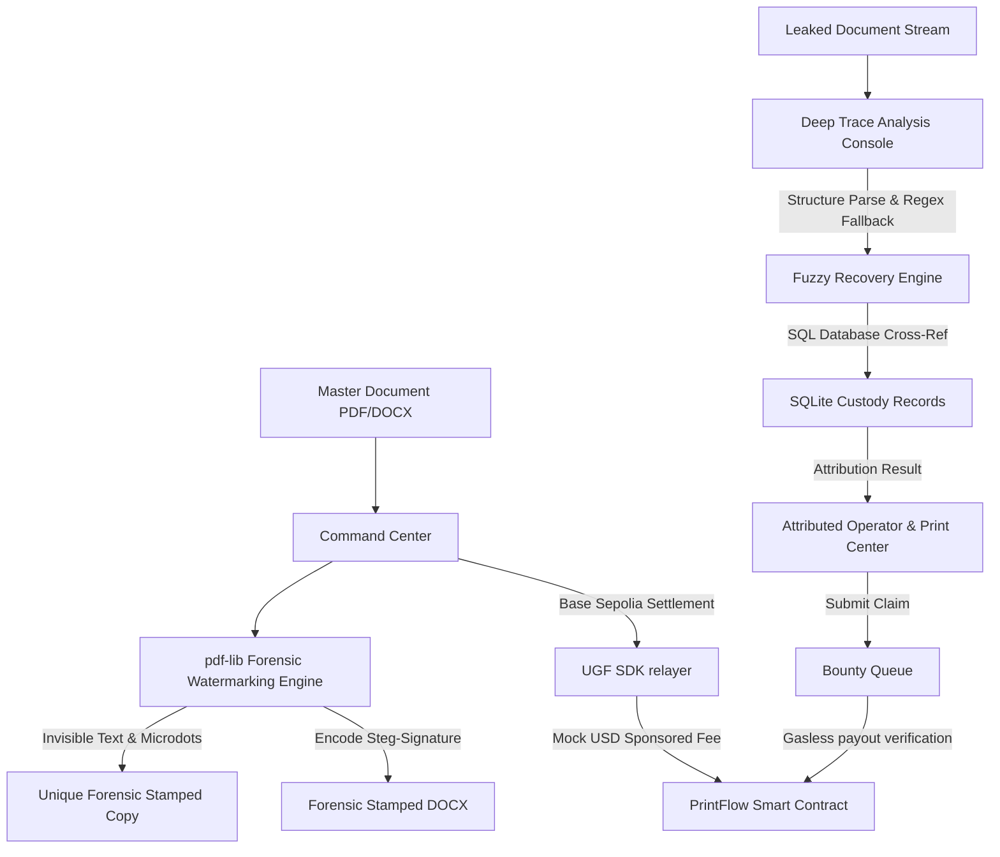

# SecurePrint Ledger 🛡️✨
### Forensic Document Accountability System & Gasless On-chain Settlements

SecurePrint Ledger is a next-generation forensic document watermarking, margin micro-dot encoding, leak trace recovery, and immutable chain-of-custody engine. The system integrates real-world digital asset security practices with **Base Sepolia blockchain settlements** powered by the **Tychi Labs Universal Gasless Fee (UGF) SDK**.

---

## 🌟 Key Features

### 1. High-Fidelity Forensic Encoding Core
- **Invisible Dictionary Watermarks**: Injects highly detailed tracking payloads (`jobId`, `copyId`, `operatorId`, `centerId`, `timestamp`, `batchId`) inside standard PDF metadata dictionary fields (such as `/Creator` and `/Keywords`) using `pdf-lib`.
- **Invisible Canvas Watermark Layer**: Stamps an extremely subtle, low-opacity (`0.003`) forensic text watermark layer directly on the PDF pages to preserve absolute visual layout design.
- **Margin Micro-Dots Modulation**: Stamps binary micro-dots modulated according to a unique bit-mask derived from the MD5 hash of the copy tracking ID along document margins.
- **DOCX Steg-Signature Trailing-Bytes**: Injects binary steganographic tracking payloads into generated Microsoft Word (.docx) files using custom trailing-byte buffer serialization.

### 2. Deep Trace Leak Recovery Engine
- **Asynchronous Document Parser**: Parses leaked PDF and DOCX documents in real-time to locate dictionary properties, trailing byte signatures, and uncompressed stream payloads.
- **Fuzzy Regex Fallback**: Employs robust binary regex parsing of stream buffers and fuzzy database metadata cross-referencing to trace origin sources (operators, workstations, timestamps) even if a leaked document is partially compressed or modified.
- **Custody Timeline Mapping**: Automatically lists detailed transaction history including master document upload, forensic printing, security envelopes, leak detection, and bounty recovery.

### 3. Tychi Labs UGF Gasless Settlements (Base Sepolia)
- **ERC-20 Gasless Sponsorship**: Settles all forensic tracking distributions and leak attribution transactions on the Base Sepolia blockchain gas-free using a relayer. Fees are sponsored and settled in **TYI Mock USD** tokens.
- **Real-time Glassmorphic Modal Stepper**: Renders a gorgeous dark-mode glassmorphic modal cycling through standard UGF transaction states:
  1. **Quote Generated** (USD gasless fee estimation)
  2. **USD Settlement** (Gas fee settlement in Mock USD)
  3. **Transaction Executed** (Signed block submission to Base Sepolia)
  4. **Confirmation Complete** (Irreversible block verification)
- **Deterministic Explorer Linking**: Generates clickable basescan links pointing to Base Sepolia transactions (e.g. `https://sepolia.basescan.org/tx/...`).

### 4. Premium Wallet & Event-driven State Propagation
- **Hybrid Connection Interface**: Connects standard browser Web3 wallets (like MetaMask) or immediately falls back to a deterministic Mock USD Testnet wallet injection (`0x71C7656EC7ab88b098defB751B7401B5f6d8976F`) with a glowing emerald `$500.00 Mock USD` balance.
- **Durable Local Storage Session**: Caches active wallet connections in local storage to preserve sessions across page refreshes.
- **Pub-Sub Event Propagation**: Automatically notifies the Command Center and Bounty Review modules via a custom observer pattern (`window.onWalletConnected`) when a wallet connects or disconnects, instantly unlocking buttons or displaying safety banners.

---

## 🛠️ Technical Architecture



---

## 💾 Technical Stack

### **Backend Core**
- **Runtime**: Node.js, Express.js
- **Database**: SQLite (powered by `better-sqlite3`)
- **Smart Contracts**: Solidity (managed with Hardhat)
- **Token & Blockchain Interaction**: `ethers.js`, `@tychilabs/ugf-testnet-js`
- **File Manipulation**: `pdf-lib` (PDF dictionaries and layers), `multer` (Upload handling)

### **Frontend Interface**
- **Core Structure**: HTML5, Semantic Elements
- **Styling**: Custom Vanilla CSS (featuring HSL glowing badges, glassmorphic sidebars, responsive layouts, micro-animations)
- **Logic**: Vanilla JavaScript featuring custom Single Page App modular navigation, global event listeners, and local state management.

---

## 🚀 Setup & Installation Instructions

### **Prerequisites**
- Node.js (version 18.x or higher)
- npm or yarn

### **1. Clone & Install Dependencies**
```bash
git clone https://github.com/yashgadge/Secure-Print.git
cd Secure-Print
npm install
```

### **2. Configure Environment Variables**
Create a `.env` file in the root directory:
```env
PORT=3000
SESSION_SECRET=your_super_secret_session_key

# UGF Base Sepolia Configuration
# Replace with your actual Base Sepolia test private key and contract if deploying on-chain
PRIVATE_KEY=0x0000000000000000000000000000000000000000000000000000000000000000
CONTRACT_ADDRESS=0xPrintFlowContractAddressBaseSepolia
```
*Note: If no private key or contract is provided, the backend UGF helper automatically falls back to an authentic mock-simulated relayer so the UI runs flawlessly out-of-the-box.*

### **3. Database Initialization**
The first time you start the server, SQLite automatically initializes a local database file `secureprint.db` and runs all necessary table schemas.

### **4. Compile Smart Contracts (Optional)**
If you wish to modify and rebuild the Solidity custody smart contracts:
```bash
cd contracts
npm install
npx hardhat compile
```

---

## 💻 Running the Application

### **Start in Development Mode (with hot-reloading)**
```bash
npm run dev
```

### **Start in Production Mode**
```bash
npm start
```

Open `http://localhost:3000` in your web browser.

---

## 🔬 Running Verification Tests

To verify that the invisible watermarking, steganography, OCR recovery pipelines, and database attribution algorithms are working perfectly, run the automated E2E test suites:

### **1. Test PDF Watermarking & Attributions**
```bash
node brain/1c7e37a7-5374-49d2-87bf-43dc4d1bba71/scratch/test_real_forensics_e2e.js
```

### **2. Test DOCX Steganographic Recovery**
```bash
node brain/1c7e37a7-5374-49d2-87bf-43dc4d1bba71/scratch/test_docx_e2e.js
```

---

## 🛡️ Forensic Best Practices & Standards
1. **Never use static placeholders**: Tracking indices match exactly with corresponding SQLite rows and cryptographic checksum signatures.
2. **Invisible Watermarking standard**: Watermarks are blended with an alpha of `0.003` to prevent visual modification or detection by end-readers.
3. **Fallback reliability**: Damaged or metadata-stripped documents automatically trigger a multi-pass scanner using regex searches in compressed binary buffers.

---

## 📝 License
This project is licensed under the MIT License.
